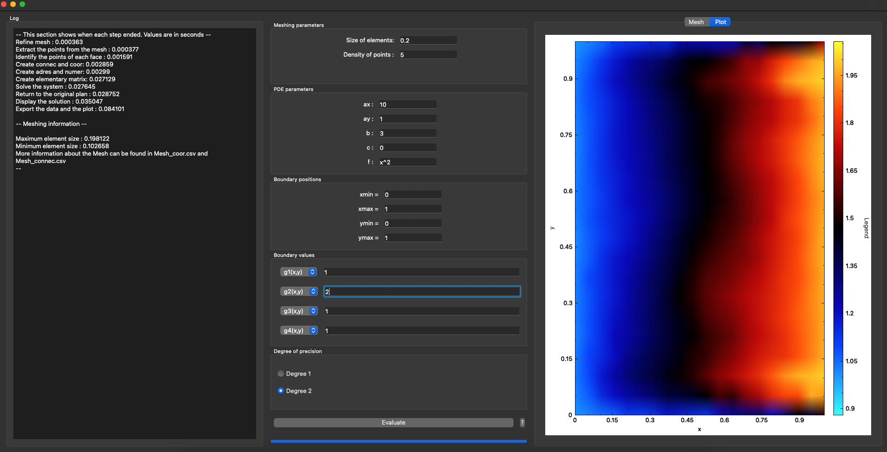

# finite-element-solver

A C++ on Qt app to solve partial differential equations in 2D. 

Refer to the doc.pdf file for more information about the application. 

# Install dependencies

```bash
brew install cmake qt5 cgal armadillo muparser superlu
```

# Build
Run the build.sh script to build and run the app.
```bash
./build.sh
```

The UI of the application: 


